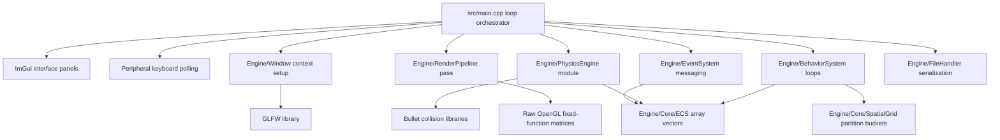

# VIE-Project
### LTU Spring 2026

- Project name: SuperEngine3D
- Team members: Nigel & Joseph

## 1. Project Overview & Architectural Vision
`SuperEngine3D` is a custom-built, 3D game engine written from scratch in C++17 utilizing raw OpenGL and GLFW. Designed specifically for frame-perfect kinematic platforming and physics, the engine bypasses heavy rigid-body physics engines to implement deterministic, arcade-style movement mechanics.

By leveraging a strict data-oriented design paradigm, the engine manages spatial grid calculations, multi-state autonomous entity AI routines, and file serialization across sub-systems while maintaining low overhead and a stable 60+ FPS frame budget.

## 2. Milestone Requirements Fulfillment Matrix
The engine satisfies and expands upon all project deliverables across the four designated development milestones:

### Milestone 1: Core Graphics Pipeline & Windowing

- Implementation: Integrated `GLFW` to manage context windows, swap buffers, and poll keyboard/mouse peripherals natively.

- Graphics Backend: Uses raw OpenGL fixed-function pipeline matrices (`glMatrixMode, glFrustum, glOrtho`) to establish a dynamic 3D rendering view alongside an isolated 2D orthographic heads-up display overlay for the player health tracker.

- Procedural Canvas: Features a continuous, high-performance ground platform procedurally textured via a sine/cosine math-based noise function.

### Milestone 2: 3D Collision Physics & Spatial Hashing

- Kinematic Physics: Built a custom kinematic solver from scratch resolving 3D Axis-Aligned Bounding Box (AABB) collision volumes.

- Stair/Hill Climbing Traversal: Features advanced step-climbing intersection routing, allowing entities to dynamically ascend sloped multi-tiered terrain (Hills) based on vertical overlap velocity thresholds.

- Spatial Optimization: Implemented a Grid-Based Spatial Hashing Partitioning system (`SpatialGrid`). By mapping dynamic entities into fixed spatial cell buckets, the engine reduces proximity lookups from a slow $O(N^2)$ nested loop down to an optimized, linear $O(N)$ lookup timeline, supporting up to 3,000 active instances.

### Milestone 3: AI State Machines & Combat Systems

- Swarm Enemy AI: Implemented autonomous patrolling enemies that dynamically sample player coordinate vectors, calculate obstacle avoidance weights around hazardous traps, and apply separation forces to prevent overlapping or grouping up.

- Multi-State Cooperative Ally: Features an advanced companion agent (Luigi) driven by an interactive state machine. By approaching the agent and striking the [E] key, the user toggles him between a passive player-following state and an active combat assistance state.

- Parabolic Jump Curve Calibration: Implemented mid-air control dampening scalars (`0.35f`) and rotational proximity deadzones for the ally agent. This prevents rapid orientation jittering and stabilizes combat leaps, allowing him to cleanly land on top of enemies to stomp them.

### Milestone 4: Data Serialization & Architecture Refactoring

- 3-Slot Save/Load Matrix: Implemented an explicit serialization backend using C++ file streams (`std::ofstream/std::ifstream`). The application saves and parses full engine configurations (player metrics, component sliders, asset blocks, and live enemy coordinates) using unique text record structures (`slot1.env, slot2.env, slot3.env`).

- Hardware File Management: Integrated file presence verification modules, automated ImGui confirmation overlay sub-states protecting existing slot configurations from accidental overwrites, and hardware file unlinking routines (`std::remove`).

- Modular Codebase Separation: Successfully refactored a monolithic source framework of over 1,000 lines into six isolated, decoupled translation subsystems to minimize build times and satisfy clean software engineering patterns.


## 3. Engine-Specific ECS Implementation
This engine utilizes a data-oriented Entity Component System (ECS) structured inside the `Registry` container to manage parallel component tables without object overhead or pointer chasing.

### Environment Component Allocation
- Implicit Entity Indexing: An `Entity` is represented as a plain `unsigned int` index handle. This identifier points to matching array rows inside the component storage matrices, binding properties together across pools without physical encapsulation.

- Contiguous Memory Buffers: Components are stored inside flat sequential vectors (`std::vector<Transform>, std::vector<PhysicsBody>, std::vector<EnemyAI>`). This design keeps data tightly packed in contiguous cache blocks.

- Decoupled System Iteration: Execution logic is completely isolated from component data structures. For example, `UpdateBehaviorSystem` operates by streaming across the `EnemyAI` vector arrays in a linear sequence using entity array index offsets, optimizing memory throughput during frame updates.


## 4. Decoupled Modular File Structure
The project directory map isolates code definitions from execution components:
```
Virtual-Interactive-Environment-Project/
├── CMakeLists.txt                # Unified CMake target builder script
├── include/                      # Master Subsystem Header Interfaces
│   └── Engine/
│       ├── Core/
│       │   ├── ECS.h             # Struct-of-Arrays Entity Component Registry
│       │   └── SpatialGrid.h     # Spatial Partition Hashing Cell Buckets
│       ├── BehaviorSystem.h      # AI tracking state machine parameters
│       ├── EventSystem.h         # Game logic messaging queue definitions
│       ├── FileHandler.h         # Stream serialization save/load utilities
│       ├── GameTypes.h           # Central data structure and enum primitives
│       ├── PhysicsEngine.h       # Kinematic AABB collision solvers
│       ├── RenderPipeline.h      # Procedural mesh OpenGL drawers
│       └── Window.h              # GLFW context wrapper abstraction
├── src/                          # Subsystem Module Source Code
│   ├── main.cpp                  # Loop Orchestrator & ImGui layout trees
│   └── Engine/
│       ├── BehaviorSystem.cpp    # Processes companion and enemy tracking
│       ├── EventSystem.cpp       # Dispatches structural block break events
│       ├── FileHandler.cpp       # Evaluates ifstream/ofstream disk records
│       ├── PhysicsEngine.cpp     # Executes 3D boundary resolution loops
│       ├── RenderPipeline.cpp    # Compiles matrix vertex drawing arrays
│       ├── SpatialGrid.cpp       # Calculates spatial cell occupancy lookups
│       └── Window.cpp            # Context configurations and viewport setups
└── README.md                     # Engine Documentation
```

## 5. Guide: Compilation & Execution

This project uses standard modern CMake configurations and manages dependency tracking internally via `FetchContent` to ensure a clean build pipeline across platform targets.

### Prerequisites
* **macOS / Linux:** CMake 3.15+, a C++17 compiler (Clang or GCC), and basic build tools (`make`).
* **Windows:** CMake 3.15+ and Visual Studio 2019/2022 with the "Desktop development with C++" workload installed.

### Build and Run Script Instructions

#### macOS / Linux Terminal Paths
```bash
# 1. Create and enter an isolated compilation build folder
mkdir -p build && cd build

# 2. Generate build system configuration files via CMake
cmake ..

# 3. Compile the application binary utilizing all available CPU hardware cores
make -j$(sysctl -n hw.ncpu)

# 4. Return to project base and launch the engine executable binary file
cd .. && ./build/VIE-Project
```

#### Windows Native Shell (PowerShell or Command Prompt)
```powershell
# 1. Create and enter an isolated compilation build folder
mkdir build
cd build

# 2. Generate the Visual Studio Solution project files via CMake
cmake ..

# 3. Compile the project target binary using the unified CMake build tool engine wrapper
cmake --build . --config Release

# 4. Return to project base and run the compiled Windows binary executable file
cd ..
.\build\Release\VIE-Project.exe
```

### In-Engine Sandbox Verification Guide
Once the application window launches, follow this verification sequence to test all implemented features:
  1. Load File Layer Verification: On the startup menu, select Load Environment. The UI will query the drive, showing slot configuration tags (e.g., Slot 1 (saved) or Slot 2 (empty)). Click Delete next to a saved slot to verify active file removal.

  2. Dynamic Canvas Building: Return and select New Environment to drop into a fresh canvas map. Use WASD to drive the player avatar. Use the ImGui Control Panel toolbar to spawn multiple Item Blocks, Wood Trees, and Small Hills.

  3. Kinematic Elevation Traversal: Walk directly into a spawned Small Hill. Verify that Mario ascends the multi-layered block steps smoothly via the internal 3D boundary collision solver.

  4. Ally AI Interaction: Open the spawning toolbar and select Swarm x10 to spawn enemies. Walk near the green ally agent (Luigi) and press [E]. The red overlay "Agent is helping" will appear on screen, and Luigi will smoothly leap over enemies and head-bonk Item Blocks. Press [E] again to transition him back to follow mode.

  5. Data Export Persistence: Open the Export menu on the editor panel, select an empty profile slot, and confirm the save. Exit back to the primary menu, select Load Environment, reload your target slot, and verify that your custom environment layout is perfectly restored.

*Note: Save files (`slotX.env`) are created natively within the directory from which you execute the runtime launch command.*

## 6. Engine Architectural Blueprint


## 7. Third-Party Libraries & References

### External Dependencies
* **GLFW (v3.3.8)** - Multi-platform library for OpenGL context creation, window management, and peripheral input handling. [https://github.com/glfw/glfw](https://github.com/glfw/glfw)
* **Bullet Physics SDK (v3.25)** - Open-source collision detection and rigid body dynamics library utilized for structural intersection testing. [https://github.com/bulletphysics/bullet3](https://github.com/bulletphysics/bullet3)
* **Dear ImGui (v1.89)** - Bloat-free graphical user interface library for C++ utilized in the engine runtime control panels. [https://github.com/ocornut/imgui](https://github.com/ocornut/imgui)

### Educational & Theoretical Resources
* **LearnOpenGL** - Foundational tutorials and implementation patterns for setting up coordinate systems, lighting matrices, and raw OpenGL pipelines. [https://learnopengl.com/](https://learnopengl.com/)
* **Game Programming Patterns (Robert Nystrom)** - Architectural references for designing decoupled Entity Component Systems (ECS) and structural game loop state updates.

## 8. License

This project is licensed under the MIT License - see below for details:

MIT License

Copyright (c) 2026 Nigel & Joseph

Permission is hereby granted, free of charge, to any person obtaining a copy
of this software and associated documentation files (the "Software"), to deal
in the Software without restriction, including without limitation the rights
to use, copy, modify, merge, publish, distribute, sublicense, and/or sell
copies of the Software, and to permit persons to whom the Software is
furnished to do so, subject to the following conditions:

The above copyright notice and this permission notice shall be included in all
copies or substantial portions of the Software.

THE SOFTWARE IS PROVIDED "AS IS", WITHOUT WARRANTY OF ANY KIND, EXPRESS OR
IMPLIED, INCLUDING BUT NOT LIMITED TO THE WARRANTIES OF MERCHANTABILITY,
FITNESS FOR A PARTICULAR PURPOSE AND NONINFRINGEMENT. IN NO EVENT SHALL THE
AUTHORS OR COPYRIGHT HOLDERS BE LIABLE FOR ANY CLAIM, DAMAGES OR OTHER
LIABILITY, WHETHER IN AN ACTION OF CONTRACT, TORT OR OTHERWISE, ARISING FROM,
OUT OF OR IN CONNECTION WITH THE SOFTWARE OR THE USE OR OTHER DEALINGS IN THE
SOFTWARE.